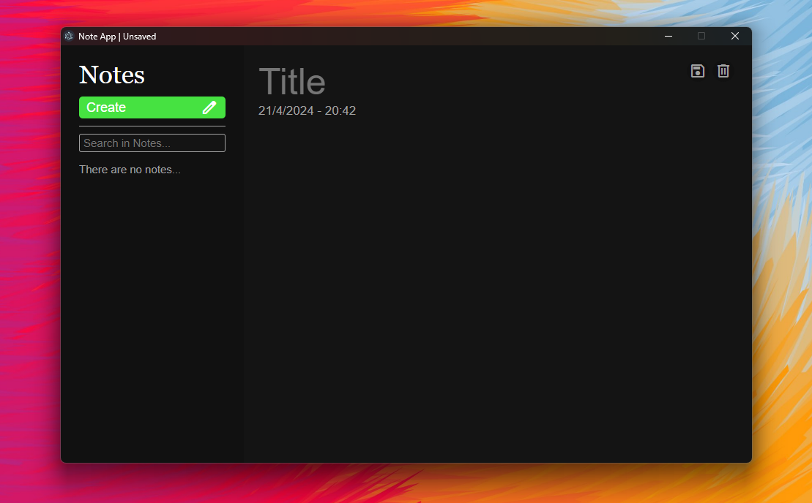

# Note App

This is a basic note-taking application built with HTML, CSS, JavaScript, Node.js, and Electron.js for desktop usage, utilizing local storage.

## Installation

Before getting started, ensure you have Node.js and npm installed on your system.

Follow these steps to install and use the project:

1. Clone the repository:

    ```bash
    git clone https://github.com/shadeIV/note-app.git
    ```

2. Install the required NPM packages:

    ```bash
    npm install
    ```

3. To start the application:

    ```bash
    npm start
    ```

## Usage

Using the app is straightforward:

- Take notes and edit them as needed.
- Simply type `npm start` in the command line to launch the app.

Feel free to explore and enhance your note-taking experience with this simple yet efficient application.

## Screenshot


